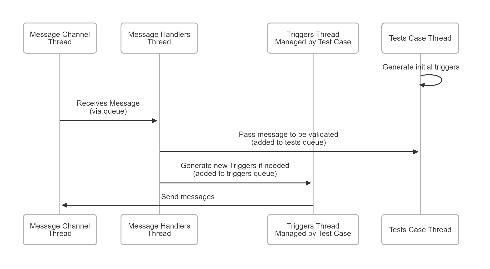
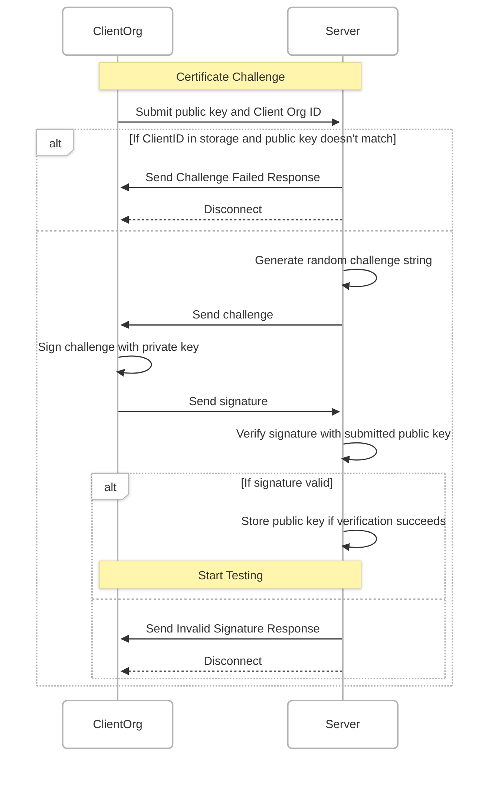

# S2 Testing and Certification Tool

<div align="center">
    <a href="https://s2standard.org"></a>
</div>
<br />

## Overview

The **S2 Testing and Certification Tool** is an open-source Python application designed to test and certify implementations of S2 CEMs and RMs that use the S2 WebSocket JSON implementation. The tool enables S2 developers to verify that their CEM or RM is compliant with the S2 specification and S2 WebSocket JSON.

The tool supports two modes of operation:

1. **Test Mode**: Run integration tests locally to validate S2 device implementations.
2. **Certify Mode**: Perform tests remotely on a secure server and generate cryptographically signed compliance certificates.

This project is developed with modularity and extensibility in mind, making it easy to add new test cases, control types, and communication protocols.

---

## Features

- **Integration Testing**: Test S2 devices locally or remotely to verify compliance with the S2 Specification and S2 WebSocket JSON.
- **Test both CEM and RM Implementations**: Test both Resource Manager (RM) and Customer Energy Manager (CEM) implementations.
- **Control Type Coverage**: Includes test scenarios for the following control types:
  - Not Controllable
  - Power Envelope Based Control (PEBC)
  - Fill Rate Based Control (FRBC)
- **Result Reporting**: Generate detailed test reports, including pass/fail status, logs, and compliance summaries.
- **Certification**: Generate cryptographically signed certificates for compliant implementations.
- **Extensibility**: Easily add new test cases, control types.

### Certification

The certificate that is produced when running in Certification mode is signed by both the client side with the Organisation's key and as well as on the server side with the Certification server's key. This overlapping signature ensures that the certificate cannot be tampered with.

> Disclaimer:
> While the tool implements cryptographic signing to ensure the integrity of the certificates, I cannot guarantee the reliability or security of the signing process at this time. The implementation is provided as-is and should not be considered a reliable cryptographic solution until it has been verified by someone with more experience in cryptographic signing. Users are advised to review the signing process and adapt it to meet their specific security requirements. Use this tool at your own discretion and risk.

See below for more details about how the signing process works.

---

## Installation

### Prerequisites

- Python 3.11 or higher
- Docker (optional, for containerized deployment)
- [UV Package Manager](https://docs.astral.sh/uv/) (for running the tool)

### Clone the Repository

```bash
git clone https://github.com/flexiblepower/s2-certification-tool.git
cd s2-certification-tool
```

### Clone with Submodules

This repository uses a custom version of the S2-Python library, included as a Git submodule. To clone the repository with the submodule, run:

```bash
git submodule init
git submodule update --remote --merge
```

> TODO: Remove this once the S2Python package is updated

---

## Usage Local

### Running the Tool

The tool is executed using the `uv` package manager. To run the tool you must provide a configuration file path as an argument. Optionally supply the `-l` flag which specifies a log file where all S2 messages will be saved.

#### Example Command

```bash
cd s2-self-cert
uv run src/s2selfcert/main.py config.yaml -l messages.log
```

When running in certification mode you need to connect to an instance of the certification server and also provide a private key in the PEM format which can be used for signing the certificate. The certificate is double signed by both the client (you) and the server. You can generate a new key with:

```bash
openssl genpkey -algorithm RSA -out org_key.pem -pkeyopt rsa_keygen_bits:2048
```

This will create a key called `org_key.pem`. Put this into your configuration file using a relative path from where you run the program or a direct path.

### Configuration

The tool uses a YAML configuration file to define the parameters for testing and certification. The config is loaded on startup and used to configure the tool. The control type specific configurations are passed to the test cases for that control type. These configurations are used to configure the tests. Below is an example configuration file and an explanation of its fields.

#### Example Configuration File

```yaml
device_details:
  name: Some Device
  manufacturer: ABCD

mode: testing  # Options: 'testing' for local testing, 'certification' for Certify Mode

certification:
  client_id: "Your Org Name" # The name of the organisation requesting the certificate. Included in the cert.
  uri: ws://localhost:8001/  # WebSocket URI for the Certification Server
  key_path: ./org_key.pem # The key used for double signing of the certificate 

connection:
  mode: server  # Options: 'server' or 'client'

  # Host and port must be supplied when in server mode
  host: 0.0.0.0  # Host address for the WebSocket server
  port: 8000     # Port for the WebSocket server

  # URI must be supplied when in client mode
  uri: wss://localhost:8000/websocket  # WebSocket URI for the S2 device

report:
  yaml: report.yaml  # Path to save the YAML report

  # If provided then a JUnit XML output is produce. Mainly for usage in GitLab CI.
  xml: report.xml    # Path to save the XML report
  xml_soft_fail_is_fail: true  # Treat soft failures as failures in the XML report

  include_test_parameters: false  # Whether to include test parameters in the report

roles:
  # Here you can enable or disable the RM or CEM testing or specific control types.
  # Any that are left blank will default to `enabled = true`
  rm:  # Resource Manager (RM) role configuration
    enabled: false 
    not_controllable:
        enabled: true
    pebc: 
      enabled: true
    frbc:
      enabled: true
  cem:  # Customer Energy Manager (CEM) role configuration
    enabled: true
    not_controllable:
      enabled: true
    pebc:
      enabled: true
      instruction_wait_timeout: 0
    frbc:
      enabled: true
      instruction_wait_timeout: 0
```

---

## Usage Server

### Running the tool

The server component of the tool is a FastAPI server that is executed using the `uv` package manager. Once the tool is running a client instance can connect in order to be tested and certified.

#### Example Command - Server

```bash
cd s2-self-cert-server
uv run fastapi dev ./src/main.py  --port 8000 --host 0.0.0.0
```

## Project Structure

The repository is organized into the following directories and files:

```text
.
├── packages                         # Shared Python packages
│   ├── connectivity                 # WebSocket communication logic
│   ├── s2-python                    # Custom version of the S2-Python library. TODO: Remove!
│   └── test-suites                  # Test suite logic
├── s2-self-cert                     # Client application
└── s2-self-cert-server              # Server application
```

The project is split into 4 python packages which are all managed by UV

---

## Architecture

The tool is built using a modular, object-oriented design. Key components include:

- **Connection Adapter**: Abstracts WebSocket communication, supporting both FastAPI and standard Python WebSocket implementations.
- **Test Suite**: Encapsulates test cases and orchestrates their execution.
- **Controllers**: Manage state and behavior for specific control types.
- **Client and Server Applications**: Facilitate local testing and remote certification.

---

## About the tool

### How the testing works

Since this tool is designed to be able to test any and all S2 devices, it creates the test cases at runtime based on the device details provided to it. For example, based on the Resource Manager Details that an RM provides, the test case will check that a device sends a forecast if the `provides_forecast` toggle is set.

Furthermore, the tests in this tool are time and event bound. Essentially the test case will do some kind of task, such as send a message, and then wait to see how the device will response. For example, sending a PEBC Instruction and waiting for power readings to validate that the PEBC is following the instruction.

In order to achieve these behaviours, the test cases are based around triggers. The test case has a queue of triggers which are executed one by one and after executing the trigger, it waits for either:

- An asyncio.Event to be set
- A wait time to be reached

Once the event has been triggered or the wait time complete, the next trigger in the queue is executed. Once the triggers queue is empty and all validations are complete, the test case is complete.

The triggers queue allows additional triggers to be added during test execution based on the messages sent by the device under test.

#### Triggers Example

We will use the RM PEBC Test Case as an example of how the triggers work. This test case can be found in `testsuites/rm/pebc_test_cases.py`.

When the test cases is started the `generate_tests` method is run which adds the initial triggers to the queue. Before anything else can happen we need to receive the PEBC Power Constraints from the device. This is done by adding a trigger with only an event which will be waited for. The `_power_constraints_received_event` is set by the power PEBCPowerConstraints message handler once it's received.

When the PEBCPowerConstraints, the main set of tests are created. Based on the power constraints we queue up a number of instruction triggers which will test all permutations of the curtailment limits. Each one of these triggers has a wait time to allow the S2 device to respond. This wait time is based on the config since different S2 devices might send power readings at different periods.

Once the new triggers have been added, the `_power_constraints_received_event` is set, causing the next trigger to be executed.

#### Making assertions

The testing in this tool is centered around Python's `unittest` assertions. The S2 Test Case inherits from the `unittest.TestCase` so assertions in the test case can be called by `self.assertEqual(True, True)` for example.

VERY IMPORTANT: Never run assertions inside of a message handler! Always create a validate method and pass the execution to the testing task (asyncio). Here's an example:

```python
await self.add_test_method(
    "Validate Instruction Status Update", # Name used in test report.
    self.validate_instruction_status_update,
    message, # Pass any args or kwargs that the validate method needs here
)
```

Inside of a validate method you can raise assertions. Once the validate method is complete it will add the test to the compliance report as:

- PASS - if no assertions raised
- FAIL - if an assertion is raised
- SOFT_FAIL - if an assertion is raised and the `fail_result_status=TestResultStatus.FAIL` is set in the `add_test_method` call

The diagram below shows the asyncio tasks which are involved in the testing. Validation can only happen on the Test Case Thread.



---

### How the Certificate Signing Works



## Adding to the Tool

This section outlines how to add new test cases to this tool.

### Adding Additional Configurations

All of the configuration data is loaded from the YAML file using Pydanic models to simplify data validation. All of the models can be found in the `connectivity` package under `config` (The location of the config is not ideal but was necessary to allow connectivity package to access the config.) The root model that all the configuration is loaded into is the `Config` class.

### Adding New Controllers

To add a new controller:

1. Create a new class that extends from the `Controller` class in `testsuite.controllers`. Be sure to set the `role` and `control_type`.

2. Add all the message handler methods to the class. All message handlers must have the following signature:

```python
async def handle_system_description_message(
    self, message: FRBCSystemDescription, channel: "S2Channel", send_okay
):
  # Handle the message
```

3. Use the add handler method in the constructor to register the handler method for the message type it's supposed to handle:

```python
self.add_handler(FRBCSystemDescription, self.handle_system_description_message)
```

4. Register the new controller with the `IntegrationTestExecutor` setup methods in `testsuites.setup.setup`. Just add the class to the `controller_classes` list.

5. Proceed to the next section to add a test case which uses this controller.

### Adding New Test Cases

To add a new test case:

1. If necessary, implement a new controller. See above... (Only necessary if implementing a totally new control type)
2. Implement a new `TestCase` class in the `testsuites` package under "./src/testsuites/test_suite"
    - Optionally, inherit from one of the existing base classes. It's a good idea to inherit from the NotControllable test case for the given role.
3. Register the new `TestCase` using the builder in the `setup` folder of the `testsuites` module.

Here is an example from the FRBC Test Case:

```python
class FRBCTestCase(NotControllableRMTestCase):
    name = "FRBC Test Case"
    control_type = ProtocolControlType.FILL_RATE_BASED_CONTROL

    controller: FRBCRMController
    config: FRBCRMTestConfig

    _system_description_received_event: asyncio.Event
    _initial_storage_status: asyncio.Event

    transitions_traversed: set

    def __init__(
        self,
        config: FRBCRMTestConfig,     # The config class for this control type
        channel: S2Channel,           # The S2 Channel used to send messages to and from the S2 Device.
        controller: FRBCRMController, # The controller that stores the state and is used for device interaction. Use it's state to perform validations.
        report: ComplianceReport,     # The test report where test results are written to.
        logger: TestLogger,           # The logger where test logs are written to.
    ):
        super().__init__(config, channel, controller, report, logger)

        # Initialise the events used for synchronisation.
        self._system_description_received_event = asyncio.Event()
        self._initial_storage_status = asyncio.Event()

        # The S2TestCase is a message handler so that we can receive messages directly. 
        # Add all the message handlers to the test case
        # If a handler is defined here then it will be used instead of the controller's handler method. 
        # You can run the controllers handler method (kindof like running super methods, ish...) with the 
        self.message_handlers[FRBCSystemDescription] = (
            self.handle_frbc_system_description
        )
        self.message_handlers[FRBCUsageForecast] = self.handle_usage_forecast
        self.message_handlers[FRBCLeakageBehaviour] = self.handle_leakage_behaviour
        self.message_handlers[FRBCActuatorStatus] = self.handle_actuator_status
        self.message_handlers[FRBCStorageStatus] = self.handle_storage_status

        self.transitions_traversed = set()

    async def generate_tests(self):
        """Add all initial triggers here"""
        await super().generate_tests()

        await self.add_trigger_method(
            None, wait_time=5, event=self._system_description_received_event
        )

    async def handle_leakage_behaviour(
        self, message: FRBCLeakageBehaviour, channel: "S2Channel", send_okay
    ):
        # Use the original handler from the controller
        await self.handle_with_original_handler(message, channel, send_okay)
        # Add a validation to be performed. NEVER PERFORM TEST VALIDATION INSIDE A HANDLER!
        await self.add_test_method(
            "9.6.3. Update Leakage Behaviour", self.validate_leakage_behaviour, message
        )
        # Wait for the reception status to finish being sent.
        await send_okay

    async def validate_leakage_behaviour(self, message: FRBCLeakageBehaviour):
        # The validation method for the leakage behaviour message.
        self.update_system_description_precondition("9.6.3.2")

        # Sanity checks
        self.assertIsNotNone(message)
        self.assertEqual(type(message), FRBCLeakageBehaviour)

        if self.controller.system_description is None:
            raise AssertionError("System Description not set on controller.")

        self.assertTrue(
            self.controller.system_description.storage.provides_leakage_behaviour,
            "Received unexpected leakage behaviour.",
        )
```

## CI Testing

In the `.ci-testing` folder are a few files that can allow you to run this integration testing suite in your CI. Currently only a GitLab CI pipeline has been created. The tool also produces a JUnit XML style report which GitLab CI can parse and include in the UI. 

All that needs to happen to allow you to test your application in CI is add the docker compose config to the `./ci-testing/docker-compose.yaml` file. And include the GitLab CI file in the root of your repository.

---

## Future Plans

- Add support for additional control types (PPBC, DDBC, OMBC).
